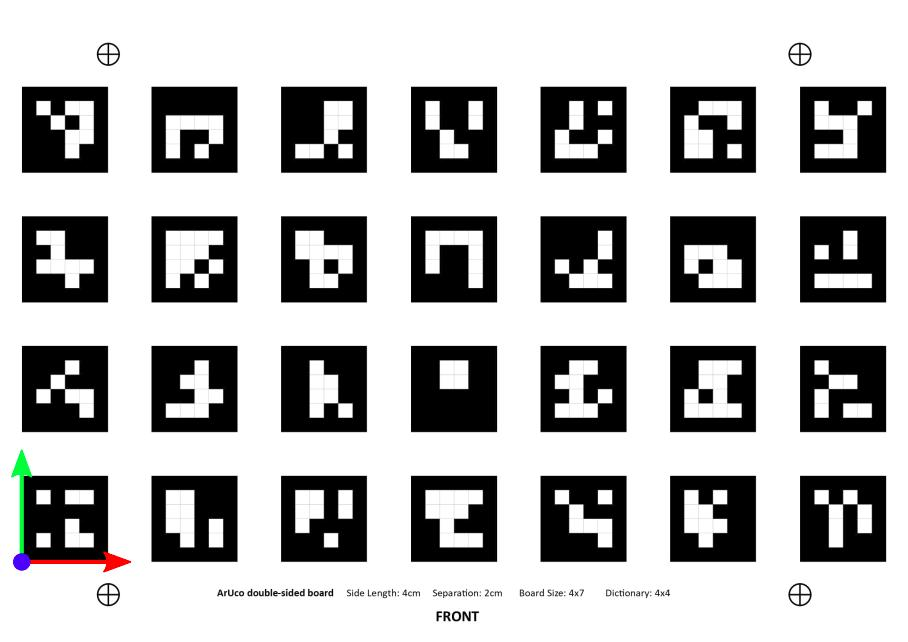
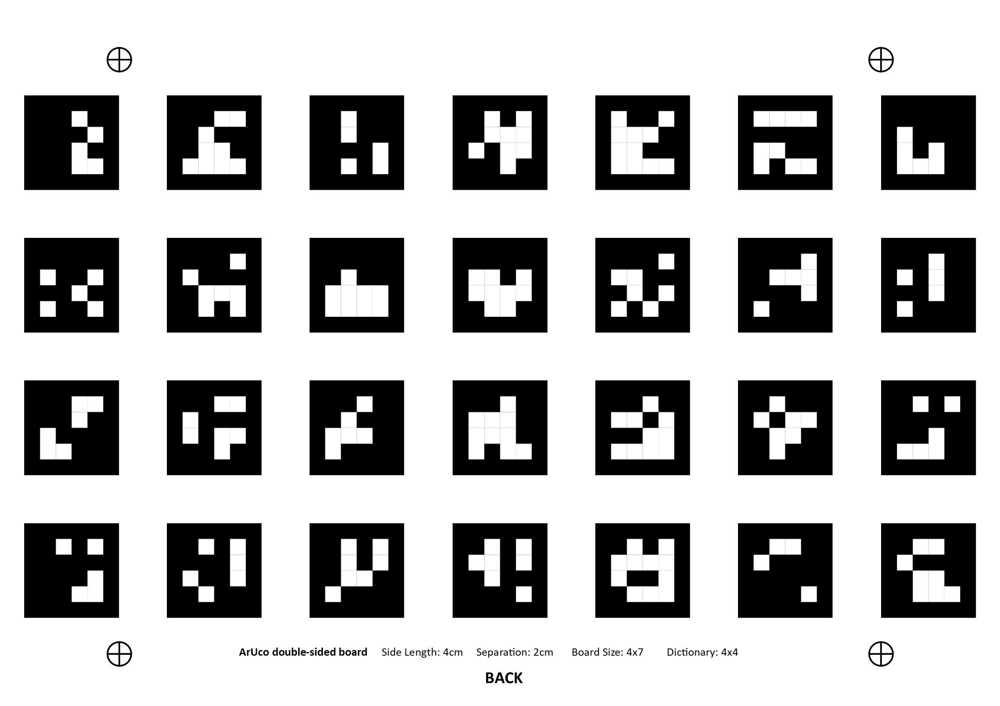

# Double-Sided Board

To carry out the extrinsic calibration of all cameras, a custom double-sided ArUco board is required. This board is comprised of ArUco tags from the DICT_4X4 dictionary and the thickness of the board is not ignored.

	
	

 

*Note the location of the origin and its coordinate system*

## Default Board Parameters

| Parameter        | Description                                                  | Default Value |
| ---------------- | ------------------------------------------------------------ | ------------- |
| markerSideLength | Side length of each ArUco tag marker                         | 0.04 m        |
| separationLength | Separation distance between markers                          | 0.02 m        |
| numRows          | Number of rows of markers                                    | 4             |
| numCols          | Number of columns of markers                                 | 7             |
| boardThickness   | Thickness of board material (assumed to be constant over entire board) | 0.0066 m      |

If you are using the provided A3 board, you will most likely need to change the board thickness to match the thickness of the material you are using. The board thickness here was measured using vernier calipers.

These parameters can be found in the [board_dimensions.yaml](./[board_dimensions.yaml) file and can be edited as required.

## Printing and Creating Board

The physical board will be made by printing both sides on plain paper, and sticking them onto a rigid flat surface made from a material which you can drill into such as:

- cardboard

- plywood

- corrugated plastic

- Plexiglass/acrylic sheets

  

A [PDF](./aruco_double_sided_board.pdf) of the original double-sided board is included which you can print.

### Instructions to create board

1. Both front and back sides need to be printed on separate piece of paper.
2. Stick the front side onto one side of the chosen board material with tape. (Make sure the paper is completely flat)
3. You will need to drill a small hole into the board at each of the four cross corner markers. This is used to line up the front and back sides. (Try to use the smallest drill bit available)
4. Flip the board over and place the back side on the board. Use the drilled holes and the cross corner markers to line up the two sides by either using a sewing pin or by flashing a light through the hole from the front side.
5. Once lined up, stick the back side on using tape  (Make sure the paper is completely flat)

## Board Marker YAML File

The MATLAB script  [CreateCustomArucoDoubleSidedBoardYAML.m](CreateCustomArucoDoubleSidedBoardYAML.m) creates a YAML file called `aruco-board-markers.yaml`  which is saved in the folder **calibration_files**. It stores the required details of the double-sided board to perform calibration. If you open the YAML file you will find the following parameters:

| Parameter  | Description                                                  |
| ---------- | ------------------------------------------------------------ |
| objPoints  | For each ArUco marker its XYZ position for each of its corners (in metres) relative to the origin. |
| ids        | For each ArUco marker, its corresponding tag ID              |
| dictionary | ArUco tag dictionary (should always be 4x4)                  |

